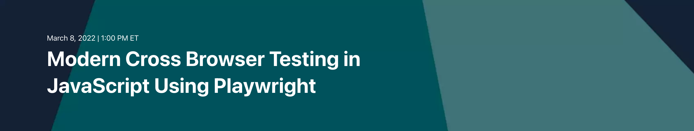

# Workshop Walkthrough

This guide provides a full written walkthrough for the
[Modern Cross Browser Testing in JavaScript with Playwright](applitools.info/w4f) workshop
led by [Pandy Knight](https://twitter.com/AutomationPanda)
and hosted by [Applitools](https://applitools.com/).
You can code along with the video recordings,
or you can reference it afterwards to help you learn more.

In this workshop, we will use **JavaScript** as our programming language.
You can also use [TypeScript](https://www.typescriptlang.org/) with Playwright (which is arguably better).


## 1. Traditional cross-browser testing

Traditional cross-browser testing requires lots of work,
both in automating test cases and in maintaining testing infrastructure.
Let's give this a try ourselves to see what it takes.


### 1.1. Writing a typical login test

Web UI testing is all about app behaviors:
interacting with visual interfaces and verifying outcomes.
Let's automate a simple website login test to use for cross-browser testing.
We will use the [Applitools demo site](https://demo.applitools.com):
`https://demo.applitools.com`.
This site has a twist, though:
it has a [second version](https://demo.applitools.com/index_v2.html)
with visual differences at `https://demo.applitools.com/index_v2.html`.

The test steps are straightforward:

```gherkin
Scenario: Successful login
  Given the login page is displayed
  When the user enters their username and password
  And the user clicks the login button
  Then the main page is displayed
```

The login page looks like this:

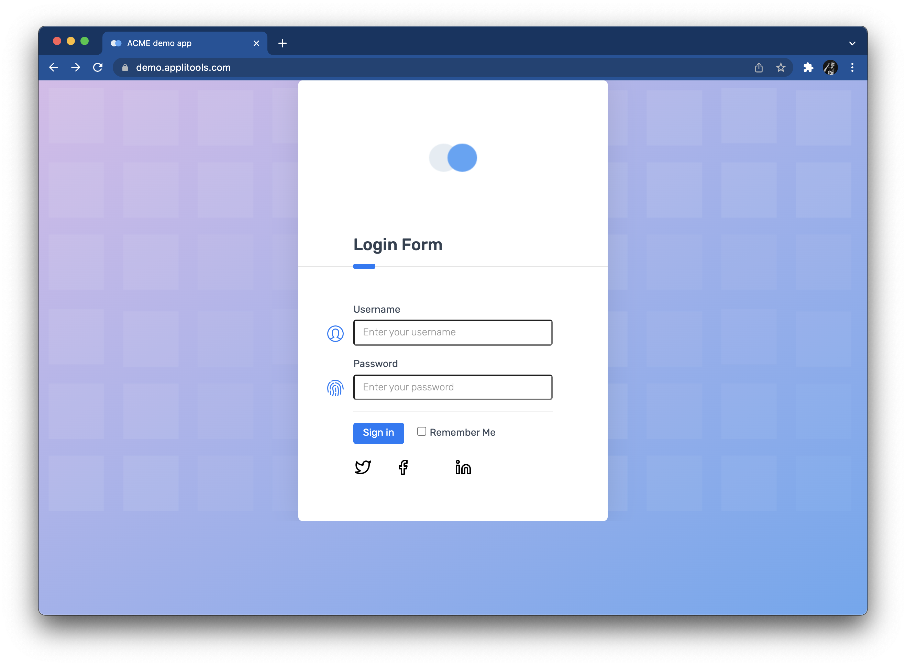

And the main page looks like this:


We can automate this test in many ways,
but for this workshop,
we will build a [Playwright](https://playwright.dev/) project written in JavaScript.


> If you are creating a new Playwright project,
> run `npm init playwright` to set everything up,
> including the installation of the package dependency.
> Then, delete `tests/example.spec.js`.
>  
> Alternatively, if you intend to run the code in this repository,
> run `npm install` to install all dependencies,
> and then run `npx playwright install` to install Playwright's browser projects.


[`tests/traditional.spec.js`](tests/traditional.spec.js)
is an automated implementation of this login test:

```javascript
const { test, expect } = require('@playwright/test');

test.describe.configure({ mode: 'parallel' })

test.describe('A traditional test', () => {

    test.beforeEach(async ({ page }) => {
        await page.setViewportSize({width: 1600, height: 1200});
    });

    test('should log into the demo app', async ({ page }) => {
        
        // Load login page
        // ...

        // Verify login page
        // ...
        
        // Perform login
        // ...

        // Verify main page
        // ...
    });
})
```

Playwright Test uses a [Mocha](https://mochajs.org/)-like structure for test cases.
Tests are grouped together in `test.describe` calls.
The `test.beforeEach` call sets the browser viewport for each test in the group.
Each test is defined using a `test` call.
Here, there is one group ("A traditional test") containing one test ("should log into the demo app").
The [`page`](https://playwright.dev/docs/api/class-page) fixture represents the browser page under test.

Loading the login page looks like this:

```javascript
        // Load login page
        let site = process.env.DEMO_SITE ?? 'original'
        let extra = (site == 'original') ? '' : '/index_v2.html'
        await page.goto('https://demo.applitools.com' + extra);
```

This segment uses an environment variable named `DEMO_SITE`
to specify if the test should run against the original site or the changed site.

Once the login page is loaded, the test verifies that certain things appear:

```javascript
        // Verify login page
        await expect(page.locator('div.logo-w')).toBeVisible();
        await expect(page.locator('id=username')).toBeVisible();
        await expect(page.locator('id=password')).toBeVisible();
        await expect(page.locator('id=log-in')).toBeVisible();
        await expect(page.locator('input.form-check-input')).toBeVisible();
```

These assertions explicitly wait for a specific set of elements to appear.
They check purely for appearance – not for any shape, size, or look.

Performing login requires a few WebDriver interactions:

```javascript
        // Perform login
        await page.fill('id=username', 'andy')
        await page.fill('id=password', 'i<3pandas')
        await page.click('id=log-in')
```

Once login is complete, the main page appears.
Unfortunately, there's almost too much on the main page to check!
The test picks a few important things and makes several assertions:

```javascript
        // Verify main page
        
        //   Check various page elements
        await expect.soft(page.locator('div.logo-w')).toBeVisible();
        await expect.soft(page.locator('div.element-search.autosuggest-search-activator > input')).toBeVisible();
        await expect.soft(page.locator('ul.main-menu')).toBeVisible();
        await expect.soft(page.locator('div.avatar-w img')).toHaveCount(2);
        await expect.soft(page.locator('text=Add Account')).toBeVisible();
        await expect.soft(page.locator('text=Make Payment')).toBeVisible();
        await expect.soft(page.locator('text=View Statement')).toBeVisible();
        await expect.soft(page.locator('text=Request Increase')).toBeVisible();
        await expect.soft(page.locator('text=Pay Now')).toBeVisible();

        //    Check time message
        await expect.soft(page.locator('id=time')).toContainText(/Your nearest branch closes in:( \d+[hms])+/);

        //    Check menu element names
        await expect.soft(page.locator('ul.main-menu li span')).toHaveText(
            ['Card types', 'Credit cards', 'Debit cards', 'Lending', 'Loans', 'Mortgages']);

        //    Check transaction statuses
        let statuses = await page.locator('span.status-pill + span').allTextContents();
        statuses.forEach(item => {
            expect.soft(['Complete', 'Pending', 'Declined']).toContain(item);
        });
```

Wow, that's a little overwhelming.
Some assertions just check that elements appear.
Others check aspects of elements, like text values.
Nevertheless, the element locators and the code for performing these assertions are a bit complex.
They also do *not* cover everything on the page.
There's risk that unchecked things could break.


### 1.2. Running the test locally

Let's run this test locally.
To manually launch tests, execute:

```bash
$ npx playwright test tests/traditional.spec.js --project=chromium --headed
```

> This repository also has npm scripts for testing declared in `package.json`.
> 
> You could alternatively run `npm run traditional -- --project=chromium --headed` from the command line.

The `--project=chromium` option will run the test against the Chromium browser,
and the `--headed` option will open the browser so you can see it run on your local machine.
The test should take only a few seconds to complete, and it should pass.

Unfortunately, this test overlooks visual things.
Take a look at the "changed" version of the demo site:

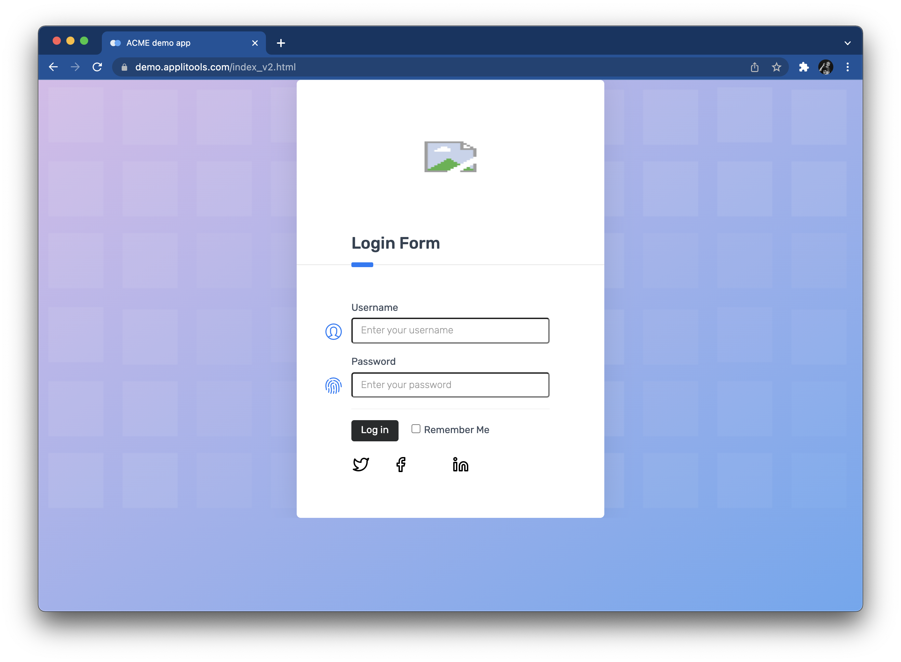

Can you spot the subtle differences?

* The icon at the top is broken
* The "Sign in" button now says "Log in"
* This button changed from blue to black

Traditional test automation struggles to detect differences like these.
We could try to add more assertions to our test,
but they'd probably be complicated and fragile.
For now, let's take a risk and ignore them.
(We will revisit ways to handle them better later in this workshop.)

Try rerunning the test with the changed demo site.
You can execute `npm run traditional:original -- --project=chromium --headed`
and `npm run traditional:changed -- --project=chromium --headed`
to specify the site version via the `DEMO_SITE` variable.
Even when `DEMO_SITE=changed`, the test will still pass.


### 1.3. Running the test against multiple browsers

Playwright can run tests against Chromium, Gecko, and WebKit.
That may sound strange.
Most test automation tools run against *full browser applications*, not *browser projects*.
All major modern browsers are based on a browser project.
Below is a table showing which projects are used by which browsers:

| Project  | Browsers                             |
| -------- | ------------------------------------ |
| Chromium | Google Chrome, Microsoft Edge, Opera |
| Gecko    | Firefox                              |
| WebKit   | Safari                               |

Playwright use projects instead of full browsers for speed and simplicity.
Tests run faster against browser projects than full browsers,
and Playwright can manage browser projects directly.
This means that you do *not* need to install any extra drivers on your test machine,
like you need to do for [Selenium WebDriver](https://www.selenium.dev/documentation/webdriver/getting_started/install_drivers/).
Playwright can also run test against a machine's stock
[Google Chrome and Microsoft Edge browsers](https://playwright.dev/docs/browsers#google-chrome--microsoft-edge).
However, it cannot run tests against other stock browsers.
Some teams may need to explicitly test full browsers instead of browser projects for their requirements.

To run Playwright tests against one of the browser projects,
you can use the `--browser` command line option.
However, since the project in this repository configures projects in `playwright.config.js`,
we must use the `--project` option.
We saw this in the previous section when using `--project=chromium`.
Other options include `webkit` and `firefox`.

You can also run tests against *all* browsers in parallel by *not* including the `--browser` or `--project` options.
By default, Playwright will run tests against all browser projects.

Run `npx playwright test tests/traditional.spec.js` (or `npm run traditional`).
The traditional test should pass in all three browsers,
and it should take only a few seconds to complete.

Note that the target browser is *not* coded into the test case itself.
Tests should be able to run against any browser,
and browsers should be selected at execution time.


### 1.4. Scaling out cross-browser testing yourself

Local testing is fine while developing automated tests,
but it's not good practice for running tests "for real."
Local machines have limits:

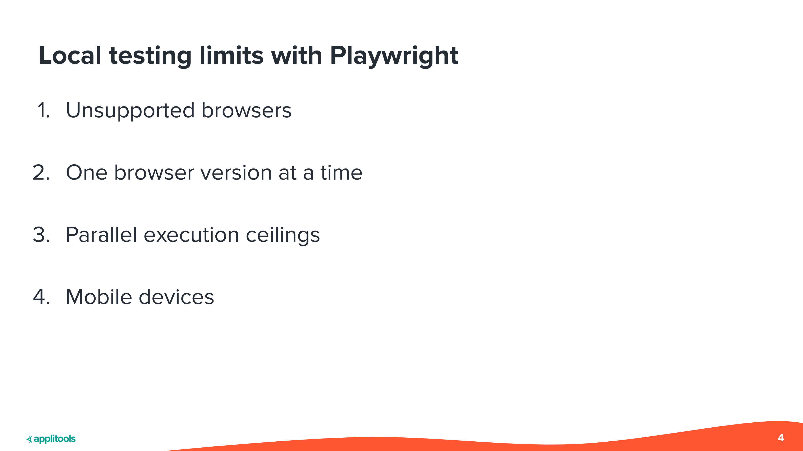

* Playwright does not support *all* browser types.
  Namely, it does not support full browsers like Firefox, Safari, and Internet Explorer.
* One machine can have only one version of a browser at a time,
  unless you make some questionable hacks.
* One machine can run only a limited number of tests in parallel.
  Optimal execution time is typically 1 web test per processor/core.
* Laptops are not mobile devices.
  Either you emulate mobile devices or connect remotely to physical devices.
  Playwright supports only [mobile emulation](https://playwright.dev/docs/emulation).

Ideally, web UI tests should be run from a Continuous Integration system
with scaled-out infrastructure to handle cross-browser testing.
Playwright provides two ways to build this type of infrastructure yourself.

The first way is by [sharding](https://playwright.dev/docs/test-parallel#shard-tests-between-multiple-machines).
You can break up your test suite into "shards" and run each shard on a different machine.
For example, the following commands would split a test suite into three shards:

```bash
$ npx playwright test --shard=1/3
$ npx playwright test --shard=2/3
$ npx playwright test --shard=3/3
```

The second way is to create your own "grid" for running remote browser sessions.
You could do this using remote debugging with Chrome DevTools Protocol.
Unfortunately, you would need to build this yourself from scratch.
There is no open source project (yet) for this type of grid.

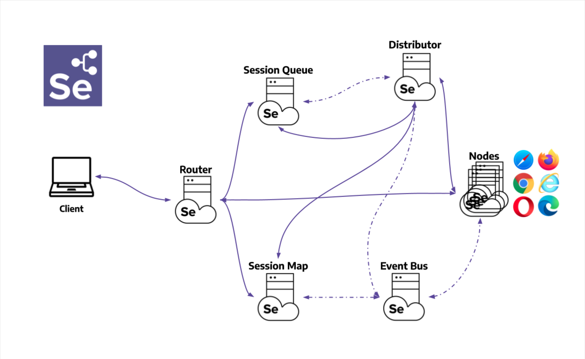

Alternatively, you could run Playwright browser sessions on a
[Selenium Grid 4](https://playwright.dev/docs/selenium-grid) instance.
These tests will be slower because they must go through the Selenium layers, but they should work.
Nevertheless, even though you do not need to code this tool,
you will need to maintain the Selenium Grid infrastructure.

I used Selenium Grid when I worked at [Q2](https://www.q2.com/).
You can read all about it in a case study I wrote in collaboration with [Tricentis](https://www.tricentis.com/):
[How Q2 uses BDD with SpecFlow for testing PrecisionLender](https://automationpanda.com/2021/09/21/how-q2-uses-bdd-with-specflow-for-testing-precisionlender/).
Basically, we created multiple Selenium Grid instances using Windows virtual machines in Microsoft Azure.
When tests launched, TeamCity (our CI system) ran PowerShell scripts to power on the VMs.
The grid would take a few minutes to boot.
Then, once tests completed, TeamCity ran PowerShell scripts to power off the VMs to save money.
Since we tightly controlled the grids, tests ran just as fast as they did on our local laptops.
We could scale up to 100 parallel tests.

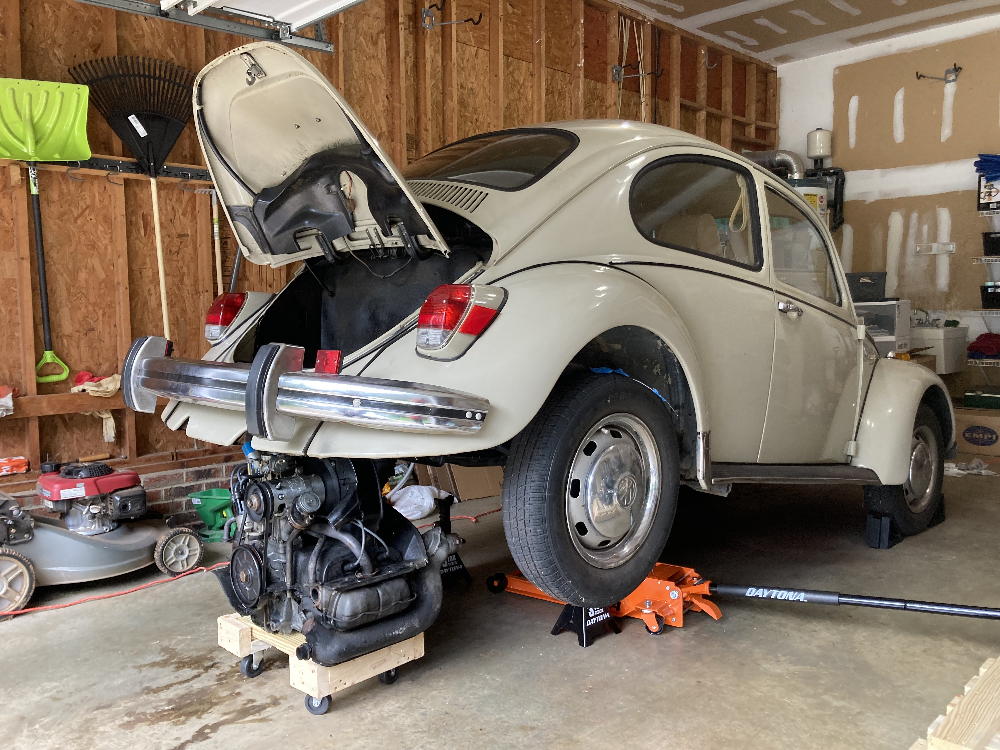

Unfortunately, do-it-yourself infrastructure is a hassle.
It's like maintaining an old car: there are always problems.
Figuring out correct setup, security policies, and performance tuning took our team *months*.
It truly was never a finished project because we kept needing to make adjustments as our suites grew.
We also had to set up and configure everything manually.
Any time a browser update came along, we needed to log into every VM and make updates.

On top of perpetual maintenance, our grids would arbitrarily crash from time to time.
Hubs would go unresponsive.
Browser sessions on nodes would freeze.
Debugging these issues was practically impossible, too.
Usually, all we could do was just relaunch test suites.

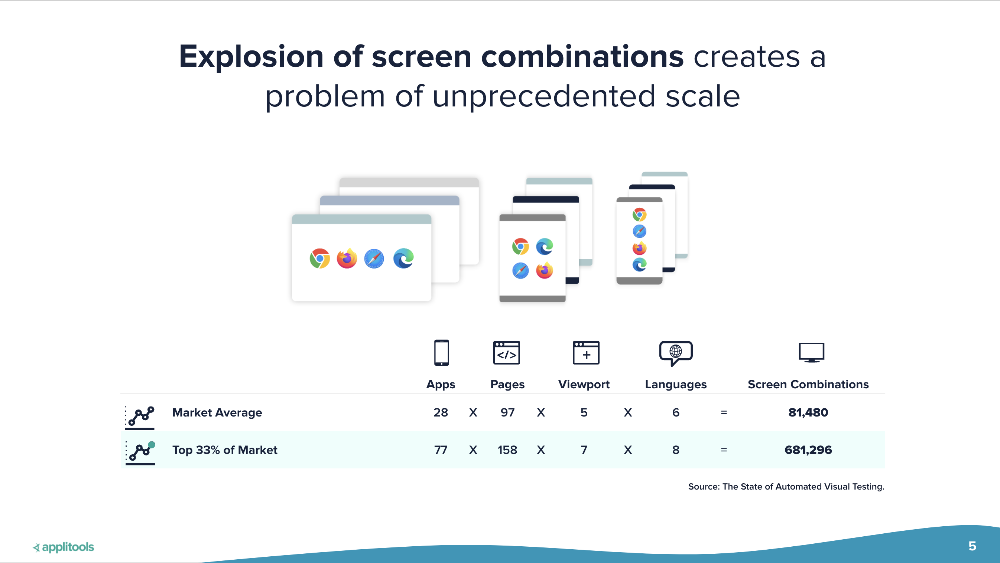

True cross-browser testing has a combinatorial explosion of screens to cover.
Think about every browser, OS, platform, and version.
Then, think about every page, viewport, and even language.
That's enormous!
Building your own grid, you can accommodate some of these, but not all.


### 1.5. Scaling out cross-browser testing as a service

Instead of building your own infrastructure,
you can pay an external vendor to provide it for you as a cloud-based service.
Many (but not all) major cross-browser testing vendors now support Playwright tests.
A vendor handles all the screen combinations for you.
Your test simply needs to declare what you want for your remote Playwright session.
Vendor platforms also typically have nice features like dashboards, screenshots, and videos.

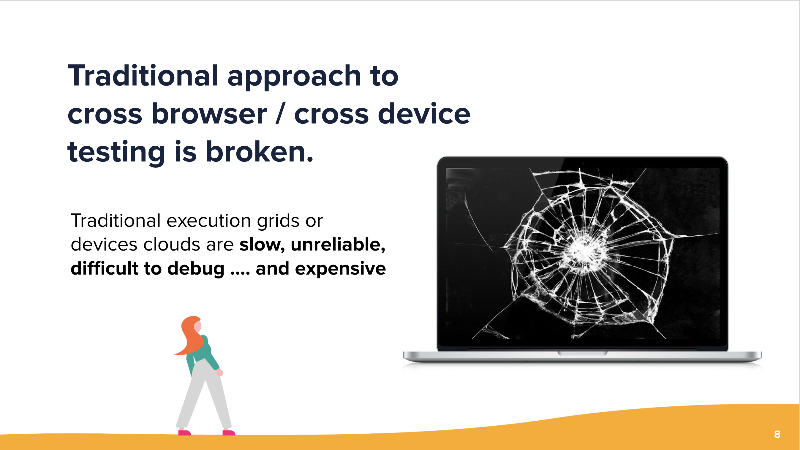

Unfortunately, traditional cross-browser-testing-as-a-service still has problems.
Difficulties with security, debuggability, and reliability are the same as for DIY grids.
Tests also run much slower because they need to communicate with a more distant session.
Anecdotally, my tests have taken 2-4x more time to complete versus running locally or in my own grid.
That's *huge*.
Furthermore, cross-browser vendor services can be quite expensive,
and they set ceilings on your level of scale with your service plans.


## 2. Modern cross-browser testing

There's got to be a better way to do cross-browser testing!
Let's rethink our approach in what we want to test
and how techniques like visual testing can simplify things.


### 2.1. Reconsidering what should be tested

What is the purpose of testing apps across multiple browsers?
Historically, browsers were radically different.
The JavaScript on one page would literally function differently in different browsers.
These days, however, browsers have largely standardized on JavaScript.
Traditional functional testing in one browser is typically good enough to verify that.
Cross-browser testing should focus on the visuals of rendering and responsiveness.

Here are some examples of visual blunders that traditional automated testing would miss:

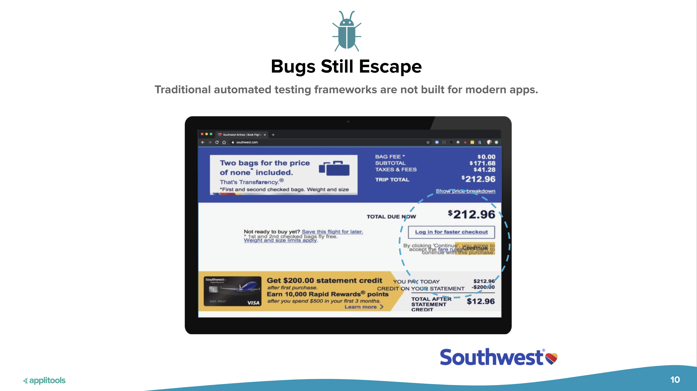

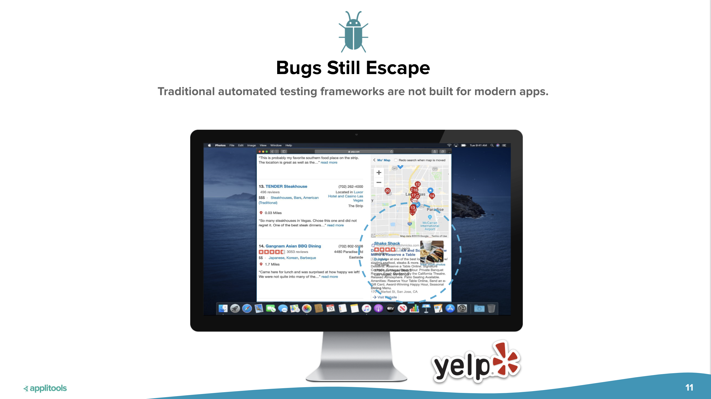

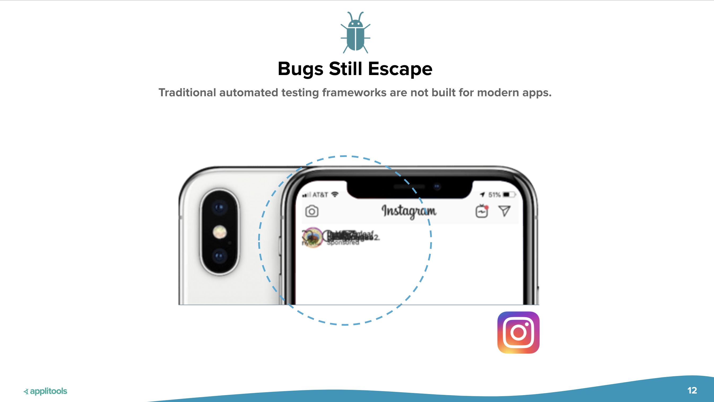


### 2.2. Introducing Applitools Ultrafast Grid

This is where Applitools can help
with a modern solution for cross-browser testing:
[Visual AI](https://applitools.com/applitools-ai-and-deep-learning/)
with the [Ultrafast Grid](https://applitools.com/product-ultrafast-test-cloud/).


Visual testing is all about capturing snapshots of pages and inspecting them for differences.
Notice how I used the word "snapshot," not "screenshot."
Screenshots are just static pixel images.
A *snapshot* is an instantaneous capture of the whole UI for a page: HTML, CSS, JavaScript, the works!
Snapshots can be re-rendered in different browsers and screen size to test their responsiveness.

Here's how we can rework our old login test into a visual test.
First, we can add the [Applitools Eyes](https://applitools.com/products-eyes/) SDK
to take visual snapshots of the login and main pages.
We still need the Selenium WebDriver automation for interactions,
but we can replace many (if not all) of the old assertions with visual checkpoints.
Next, we can configure a runner to render those snapshots
using multiple browsers and devices in Applitools Ultrafast Grid.
The test will run once locally,
but all cross-browser testing will be done in the Applitools Cloud with parallel execution.

Since the only testing done in Ultrafast Grid is visual rendering and comparison, it's very fast.
The infrastructure is also simpler because communication is a single direction
from the test machine to the Applitools cloud.
There's no back-and-forth communication like with a traditional functional test.

You can use Applitools Eyes and the Ultrafast Grid with any automation tool or framework:
Playwright, Cypress, Selenium, Appium, WebDriverIO, Nightwatch, and more.

If you want specific data on how much faster and more efficient your testing can be
with Visual AI and Applitools Ultrafast Grid,
then check out this report:
[Modern Cross Browser Testing Through Visual AI Report: 3,112 hours of empirical data sourced from 203 engineers](https://applitools.com/modern-cross-browser-testing-report/).


### 2.3. Rewriting login as a visual test

Let's rewrite our login test into a visual test.
The test steps can remain the same, but the setup and assertions will change.
In this repository,
[`tests/visual.spec.js`](tests/visual.spec.js)
contains the updated code.

First, we need to install the Applitools Eyes SDK for Playwright:

```bash
$ npm install -D @applitools/eyes-playwright
```

Then, we need to import some new things from the Applitools Eyes SDK:

```javascript
const { test } = require('@playwright/test');
const {
    VisualGridRunner,
    Eyes,
    Configuration,
    BatchInfo,
    BrowserType,
    DeviceName,
    ScreenOrientation,
    Target,
    MatchLevel
} = require('@applitools/eyes-playwright');
```

Next, we must configure tests to run against different browser configurations in Applitools Ultrafast Grid.
Add the following test structure with the `test.beforeEach` call:

```javascript
test.describe.configure({ mode: 'parallel' })

test.describe('A visual test', () => {
    let eyes, runner;

    test.beforeEach(async ({ page }) => {
        await page.setViewportSize({width: 1600, height: 1200});

        runner = new VisualGridRunner({ testConcurrency: 5 });
        eyes = new Eyes(runner);
    
        const configuration = new Configuration();
        configuration.setBatch(new BatchInfo('Modern Cross Browser Testing in JavaScript with Playwright'));
    
        configuration.addBrowser(800, 600, BrowserType.CHROME);
        configuration.addBrowser(700, 500, BrowserType.FIREFOX);
        configuration.addBrowser(1600, 1200, BrowserType.IE_11);
        configuration.addBrowser(1024, 768, BrowserType.EDGE_CHROMIUM);
        configuration.addBrowser(800, 600, BrowserType.SAFARI);
    
        configuration.addDeviceEmulation(DeviceName.iPhone_X, ScreenOrientation.PORTRAIT);
        configuration.addDeviceEmulation(DeviceName.Pixel_2, ScreenOrientation.PORTRAIT);
        configuration.addDeviceEmulation(DeviceName.Galaxy_S5, ScreenOrientation.PORTRAIT);
        configuration.addDeviceEmulation(DeviceName.Nexus_10, ScreenOrientation.PORTRAIT);
        configuration.addDeviceEmulation(DeviceName.iPad_Pro, ScreenOrientation.LANDSCAPE);
    
        eyes.setConfiguration(configuration);
    });
})
```

The `beforeEach` call does many things:

1. It sets a viewport size for local testing (which is also done in `traditional.spec.js`).
2. It creates a `VisualGridRunner` with a test concurrency of 5.
   * If you have a free Applitools account, your concurrency will be limited to 1.
3. It creates a configuration with a batch named `'Modern Cross Browser Testing in JavaScript with Playwright'`.
4. It sets the configuration to test 5 desktop browsers and 5 emulated mobile devices.

The login test's steps will remain the same,
but we need to make Applitools Eyes watch the browser.
We do that by starting each test with `eyes.open(...)`
and ending each test with `eyes.close()`.
When opening Eyes, we also specify the names of the app and the test:

```javascript
    test('should log into the demo app', async ({ page }) => {
        
        // Open Applitools Eyes
        await eyes.open(page, 'Applitools Demo App', 'Login');

        // Test steps
        // ...

        // Close Applitools Eyes
        await eyes.close(false)
    });
```

The load and login steps do not need any changes because the interactions are the same.
However, the "verify" steps reduce drastically to one-line snapshot calls:

```javascript
    test('should log into the demo app', async ({ page }) => {
        
        // ...

        // Verify login page
        await eyes.check('Login page', Target.window().fully());
        
        // ...
        
        // Verify main page
        await eyes.check('Main page', Target.window().matchLevel(MatchLevel.Layout).fully());

        // ...
        
    });
```

If a picture is worth a thousand words, then
**a snapshot is worth a thousand assertions**.
Previously, these steps had multiple complicated assertions
that merely checked if some elements appeared or had certain text values.
Now, Applitools Eyes captures a full snapshot,
checking *everything* on the page like a pair of human eyes.
It's one, simple, declarative capture.
We just say "check it" instead of spending time splicing selectors and making explicit comparisons.
It also covers aspects like broken images and colors that our traditional functional test missed.

As a software engineer myself,
I cannot understate how much development time these visual checkpoints save me.
I spend so much time trying to find locators and program clever assertions,
but they are so fragile,
and there are only so many assertions I can include.

Finally, after each test, we need to do some safety handling and result dumping:

```javascript
    test.afterEach(async () => {
        await eyes.abort();

        const results = await runner.getAllTestResults(false);
        console.log('Visual test results', results);
    });
```

These are the only changes we need to make to the test case
to convert it from a traditional functional test to a visual one.
Not bad!


### 2.4. Running visual tests across multiple browsers

To run tests, we must set our Applitools API key as a system environment variable.
You can fetch your key under your account in the Applitools dashboard.

On macOS and Linux:

```
$ export APPLITOOLS_API_KEY=<value>
```

On Windows:

```
> set APPLITOOLS_API_KEY=<value>
```

Let's run the visual version of the login test with the original site to set baselines:

```bash
$ npm run visual:original
```

> This command is equivalent to running
> `npx DEMO_SITE=original playwright test tests/visual.spec.js --project=chromium`.

When launched locally, you should see the test run headlessly.
Then, the automation uploads the snapshots to Applitools Ultrafast Grid to run against the ten other targets.
All tests should take about half a minute to complete.

> *Warning:*
> You might need to increase Playwright's standard timeout in `playwright.config.js`.
> By default, this timeout is 30 seconds.
> In this repository, it is set to 60 seconds.

Results in the Applitools Eyes dashboard should look like this:

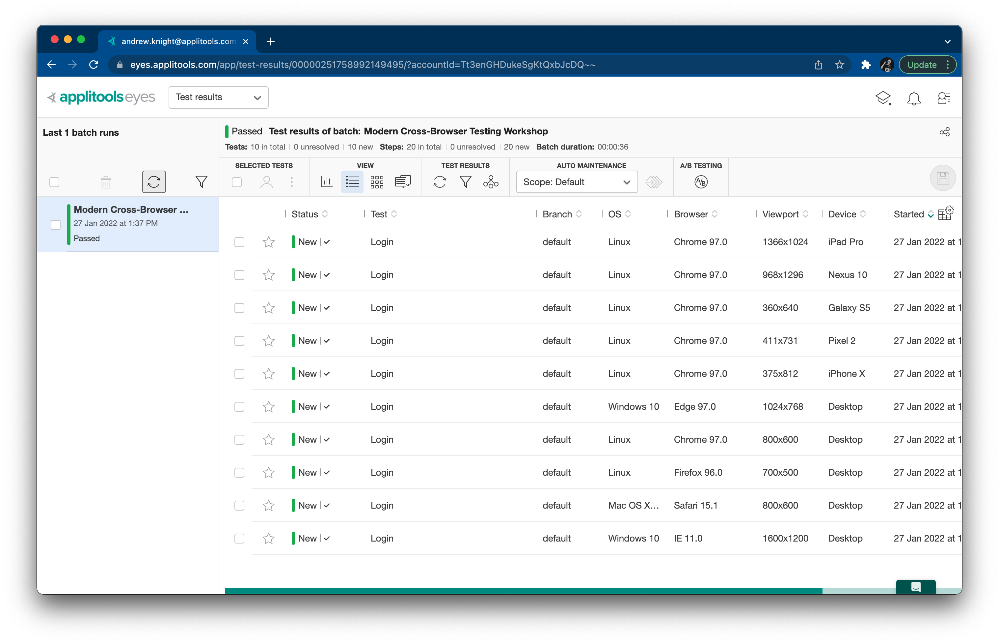

Notice how the batch of tests has one test for each target configuration.
Each test has two snapshots: one for the login page, and one for the main page.
All tests have "New" status because they are baselines.
Also, notice how little time it took to run this batch of tests.
Running our test across 10 different browser configurations
with 2 visual checkpoints each at a concurrency level of 5 took only 36 seconds to complete.
That’s ultra fast!
Running that many test iterations locally or using other infrastructure could take several minutes.

Run the tests again.
The second run should succeed just like the first.
However, the new dashboard results now say "Passed"
because Applitools compared the latest snapshots to the baselines
and verified that they had not changed.
You can also group results by browser, OS, and other criteria:

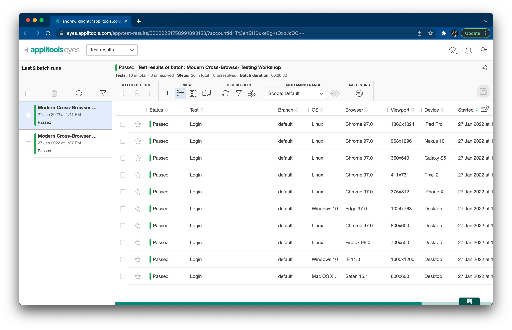

To show the power of Visual AI in testing,
let's run the tests one more time with visual changes to the demo site:

```bash
$ npm run visual:changed
```

> This command is equivalent to running
> `npx DEMO_SITE=changed playwright test tests/visual.spec.js --project=chromium`.

This time, changes are detected on the login page!
Differences between the baseline and the current snapshot are highlighted in magenta.
Changes are *not* detected on the main page despite different numbers on the page
because we set the match level to LAYOUT.

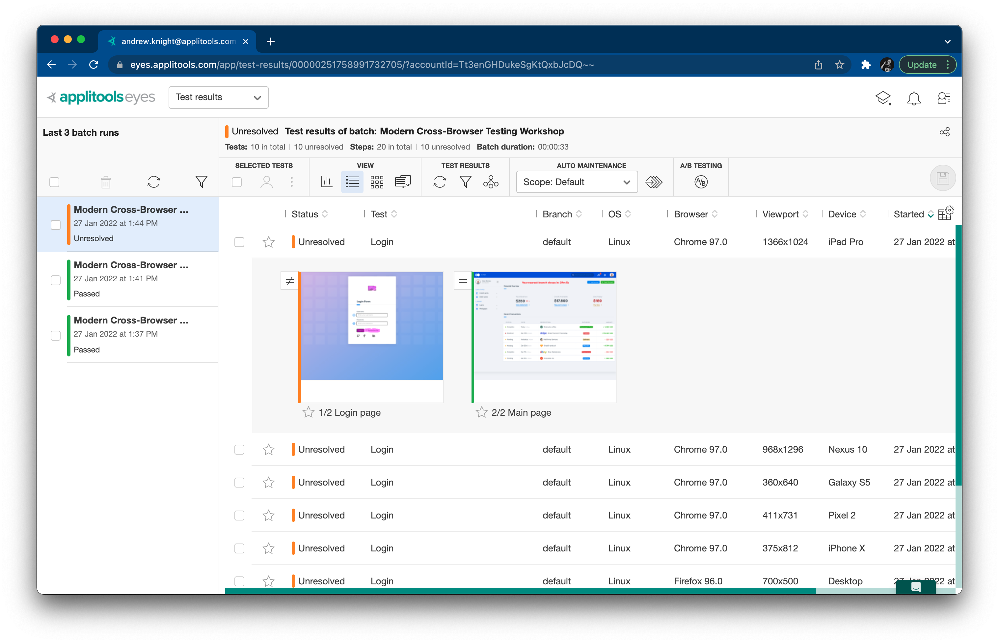

We can address these results just like any other visual results:

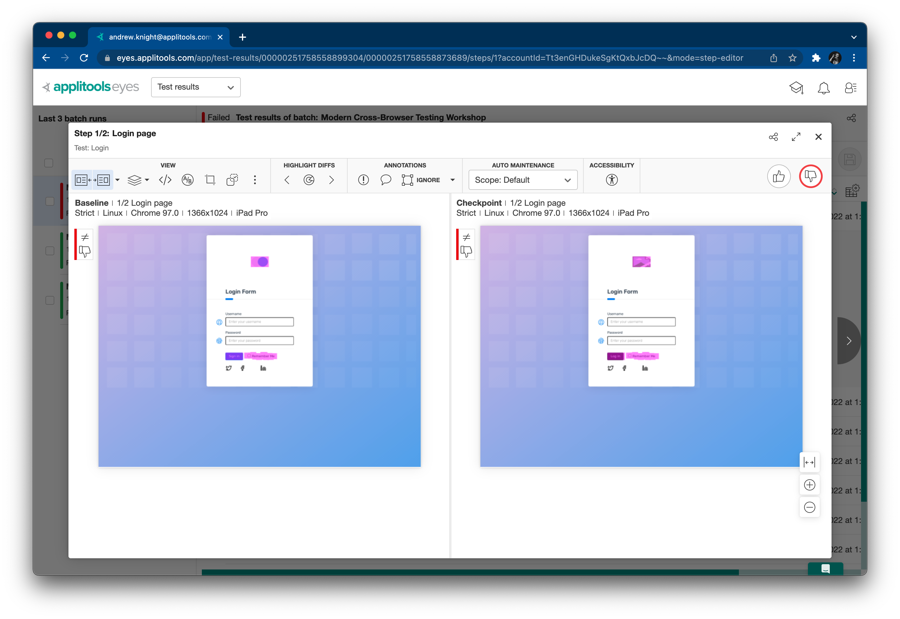

As you can see, the big advantages of this type of cross-browser testing are:

1. *Speed:* tests take second instead of minutes
2. *Simplicity:* visual checkpoints replace complicated assertions
3. *Sharpness:* Visual AI accurately highlights meaningful changes to a human eye

Another unique advantage of using Applitools Visual AI together with Playwright
is that tests can cover *any* browser configuration, even ones not supported locally by Playwright.
That means you can run Playwright tests against full Firefox, Safari, and Internet Explorer browsers.


### 2.5. Integrating modern cross-browser testing with CI/CD

Just like any other automated test suite,
visual tests with Applitools Eyes and Ultrafast Grid can (and should)
run from a Continuous Integration and Delivery (CI/CD) system.
For example, you can integrate Applitools Eyes with Jenkins using the
[Jenkins plugin](https://plugins.jenkins.io/applitools-eyes/),
or you could simply launch tests from an agent's command line as part of a build job.

CI/CD systems can trigger tests automatically:

* *continuously* after code changes
* *periodically* on schedules (like every night)
* *on demand* whenever users manually launch tests

This repository is configured with GitHub Actions to run the visual login test:

* [Run Visual Test (Original)](https://github.com/applitools/workshop-cbt-playwright-js/actions/workflows/run-visual-test-original.yml)
  runs the test with the original pages.
* [Run Visual Test (Changed)](https://github.com/applitools/workshop-cbt-playwright-js/actions/workflows/run-visual-test-changed.yml)
  runs the test with the changed pages to reveal visual failures.

Ideally, teams want to get as many results as they can as quickly as possible.
Fast feedback means that teams can resolve issues before they become more costly to fix.
Unfortunately, traditional UI tests tend to be slow, especially with cross-browser variations.
Teams face a tradeoff between coverage and fast feedback:
more coverage means lower risk but slower feedback.
Modern cross-browser testing with Visual AI and Applitools Ultrafast Grid enables more testing in less time,
which widens coverage, preserves fast feedback, and enables UI testing to become continuous.
It shifts testing further left.
